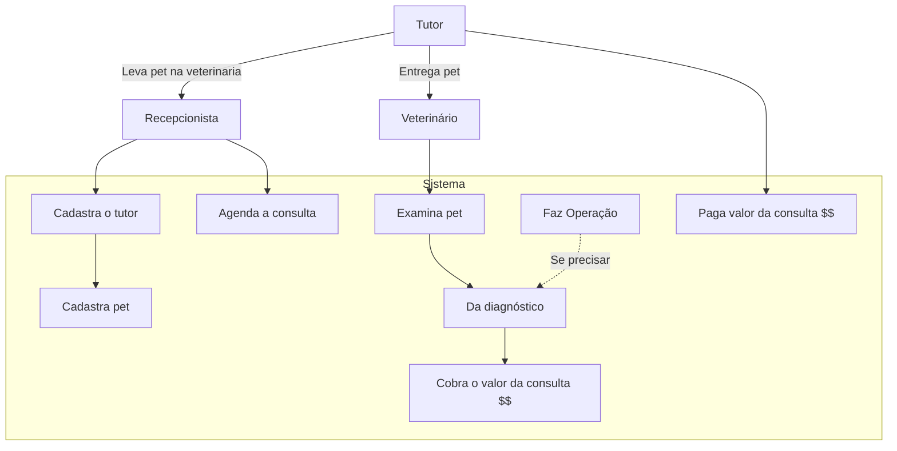
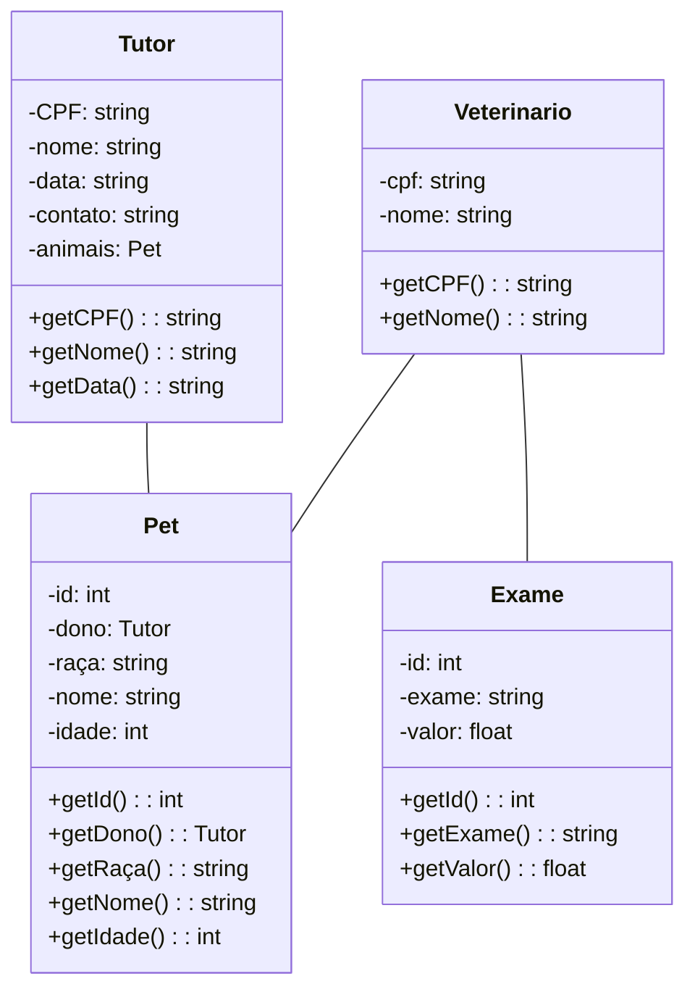

# Clínica Veterinária
Trabalho de final da matéria de Engenharia de Software. [2° Semestre/2026]

### Prototipo
Prototipo no Figma: [Aqui](https://www.figma.com/design/0kAb3nbGc9SY4zAAa7lrjq/Clinica-Veterinaria?t=4Qsj4DI84pijXLV3-1)

## Diagramas UML

### Diagrama de caso de uso:

### Diagrama de classes

